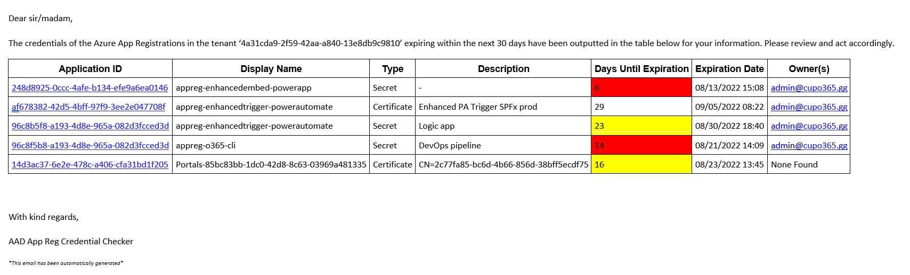
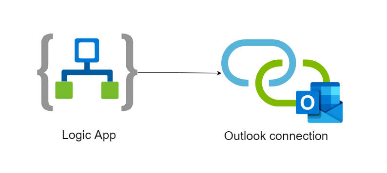

#  AAD App Registration Credential Checker Logic App

## Table of Contents
  - [Summary](#summary)
  - [Applies to](#applies-to)
  - [Prerequisites](#prerequisites)
  - [Solution](#solution)
  - [Version history](#version-history)
  - [Supported languages](#supported-languages)
  - [List of functionalities](#list-of-functionalities)
  - [How to implement](#how-to-implement)
  - [Download the solution](#download-the-solution)

## Summary

This solution periodically provides you with a Birdseye view of all upcoming expiring credentials (certificate or secret) for Azure App Registrations within one (single) or more (multi) tenants. The solution allows you to always have access to crucial information, so that you yourself will not have to worry anymore about keeping track of an expiring credential for a crucial business process within your organization or for one of your customers.

The overview you receive contains extensive information about the expiring credentials, along with color coding to point out the earliest expiring ones. You are able to configure to whom the overview should be sent, what the boundaries of a credential expiring soon or very soon are and much more. For more information, check out the [list of functionalities](#list-of-functionalities). And with the included azuredeploy PowerShell script, you can have this solution **up-and-running within five minutes!** See [how to implement](#how-to-implement) here.


**[__Download the solution files here!__](https://github.com/cupo365/aad-app-registration-credential-checker/releases/tag/v2.1.0)**

## Applies to

- [Logic Apps](https://docs.microsoft.com/en-us/azure/logic-apps/logic-apps-overview)
- [Azure App Registrations](https://docs.microsoft.com/en-us/azure/active-directory/develop/quickstart-register-app)
- Secrets
- (Self signed) certificates

## Prerequisites

> - An M365 admin account. Get your own free Microsoft 365 tenant from [M365 developer program](https://developer.microsoft.com/en-us/microsoft-365/dev-program)
> - An Azure subscription
> - An Exchange Online mailbox (Outlook Online)
> - (optional) PowerShell 5.1 installed on your machine to deploy the solution via scripting
> - (optional) If using multi tenant, App Registrations with User.Read.All and Application.Read.All Graph application permissions for each configured tenant

## Solution

| Solution                                              | Author(s)                                     |
| ----------------------------------------------------- | --------------------------------------------- |
| AAD App Registration Credential Checker Single Tenant | cup o'365 ([contact](mailto:info@cupo365.gg)) |
| AAD App Registration Credential Checker Multi Tenant  | cup o'365 ([contact](mailto:info@cupo365.gg)) |

## Version history

| Version                                                                                       | Date           | Comments                       |
| --------------------------------------------------------------------------------------------- | -------------- | ------------------------------ |
| [1.0](https://github.com/cupo365/aad-app-registration-credential-checker/releases/tag/v1.0.0) | April 3, 2022  | Initial release                |
| [2.0](https://github.com/cupo365/aad-app-registration-credential-checker/releases/tag/v2.0.0) | August 7, 2022 | Logic app release              |
| [2.1](https://github.com/cupo365/aad-app-registration-credential-checker/releases/tag/v2.1.0) | August 9, 2022 | Single & multi tenant versions |

## Supported languages

- English
- Dutch

## List of functionalities

- Periodically send an overview of expiring Azure App Registration credentials within a configured tenant
  
- Configurable parameters (single tenant):
  | Parameter                                 | Type    | Description                                                                                                                                                                                           | Example                           |
  | ----------------------------------------- | ------- | ----------------------------------------------------------------------------------------------------------------------------------------------------------------------------------------------------- | --------------------------------- |
  | parCulture                                | string  | The [culture ID](https://blog.muhimbi.com/2009/04/sharepoint-supported-languages-culture.html) of the language the overview should be send in. See also: [supported languages](#supported-languages). | 1033 (English)                    |
  | parDryRun                                 | boolean | Whether the logic app runs in dry mode or not. If in dry mode, the flow will not send the overview.                                                                                                   | true                              |
  | parErrorObservers                         | string  | The email address(es) of the observers in case the flow run encounters an error. When multiple, combine addresses with a semicolon (;) delimiter like in Outlook.                                     | admin@cupo365.gg                  |
  | parExpiresSoonBoundary                    | int     | Determines the outer bounds of when an expiring credential is marked as 'soon'. This will result in a yellow background in the overview.                                                              | 25                                |
  | parExpiresVerySoonBoundary                | int     | Determines the outer bounds of when an expiring credential is marked as 'very soon'. This will result in a red background in the overview                                                             | 15                                |
  | parNotificationObservers                  | string  | The email address(es) to which the overview should be send to. When multiple, combine addresses with a semicolon (;) delimiter like in Outlook.                                                       | admin@cupo365.gg; info@cupo365.gg |
  | parNotifyIfExpirationIsWithinTheNextXDays | int     | The outer bounds of expiring credentials to include in the overview in days.                                                                                                                          | 30                                |
  | parRunsEveryXDays                         | int     | The periodical interpretation of how often the logic app should run in days.                                                                                                                          | 30                                |
- Configurable parameters (multi tenant):
  | Parameter         | Type    | Description                                                                                         | Example                                                                                                                                                                                                                                                                                                                                                             |
  | ----------------- | ------- | --------------------------------------------------------------------------------------------------- | ------------------------------------------------------------------------------------------------------------------------------------------------------------------------------------------------------------------------------------------------------------------------------------------------------------------------------------------------------------------- |
  | parDryRun         | boolean | Whether the logic app runs in dry mode or not. If in dry mode, the flow will not send the overview. | true                                                                                                                                                                                                                                                                                                                                                                |
  | parTenantsToCheck | array   | The tenants to check and their configuration                                                        | ```[ { "TenantId": "5bf308d5-cb4c-4e20-9f81-e08f34a9fef3", "ClientId": "1a04839c-2097-4951-ab28-f3803ccb1aa8", "ClientSecret": "1234secret4321", "NotificationObservers": "info@cupo365.gg", "ErrorObservers": "info@cupo365.gg", "Culture": "1033", "NotifyIfExpirationIsWithinTheNextXDays": 60, "ExpiresSoonBoundary": 30, "ExpiresVerySoonBoundary": 15 } ] ``` |
  | parRunsEveryXDays | int     | The periodical interpretation of how often the logic app should run in days.                        | 30                                                                                                                                                                                                                                                                                                                                                                  |
- Error handling: send an error message if the logic app run fails

## How to implement

With the included [azuredeploy PowerShell script](https://github.com/cupo365/aad-app-registration-credential-checker/releases/tag/v2.1.0), you can deploy and have the solution up-and-running within 5 minutes. The PowerShell scripts executes a program with certain steps. These steps will be explicated underneath. 
- The script will validate the PowerShell runtime version. There is a known bug within PowerShell 7 for one of the required modules (Az), so only PowerShell 5.1 is allowed
- The script will import all required PowerShell modules. If one or more modules are not yet present on the machine, these will be installed automatically. The required modules are:
  - AzureAD
  - Az
  - AzureRm
- The script will prompt for credentials and login to Azure
  > Note: login with an admin account
- The script will verify the existence of the Azure resource group (of which the name is configured in the parameters of the script). If the resource group does not yet exist, the script will create it
- The script will deploy the included [Azure resource template](https://github.com/cupo365/aad-app-registration-credential-checker/releases/tag/v2.1.0) to the resource group. The template includes a parameter file in which you can configure certain aspects of the resource deployment. The script verifies the provisioning state of the deployment. The deployed resources are shown in the image below:

- The script will assign the required permissions to the system assigned managed identity created for the Logic App. The minimum required permissions are:
  - User.Read.All (Graph, Application)
  - Application.Read.All (Graph, Application)
  > Note: this step is only required for the single tenant version of the solution. If using multi tenant, provide App Registration credentials for each configured tenant in the parameters of the logic app. The app regs still required the afore mentioned minimum permissions
- The script will authorize the created Outlook connection by prompting you with a separate login dialog. You can login with the account you want to send the email from

> Note: if do not want to use the PowerShell script, you will have to execute these steps manually!

The script contains error handling.

## Download the solution


**[__Download the solution here!__](https://github.com/cupo365/aad-app-registration-credential-checker/releases/tag/v2.1.0)**